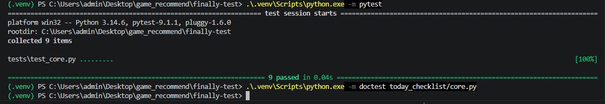

# 작성자 정보
학과 : 컴퓨터공학과
학번 : 202620856
이름 : 김효은

# 프로젝트 제목: 오늘 할 일 관리 시스템(today_checklist)

# 1. 프로젝트 개요 (Project Overview)
본 프로젝트는 사용자의 편의를 위해 하루일과나 체크리스트를 효율적으로 관리하기 위해 만들어진 프로그램입니다. 사용자가 설정한대로 하루일과나 체크리스트가 제작되며 완료할시 빈박스가 체크박스로 변환되어 사용자의 편의를 위해 시각적으로 보여지게 설계하였습니다.

# 2. 설치 방법 (Installation)
프로젝트를 실행하고 테스트하기 위해 아래 명령어를 터미널에 순서대로 입력하여 가상환경을 구축하고 의존성 패키지를 설치합니다.

```bash
# 1. 프로젝트 디렉토리로 이동
cd finally-test

# 2. 가상환경 활성화 (Windows PowerShell 기준)
.\.venv\Scripts\Activate.ps1

# 3. 필요한 의존성 패키지 설치
.\.venv\Scripts\python.exe -m pip install -r requirements.txt
```

# 3. 주요 기능 설명 (Key Features)
체크리스트
- 시간에 관계없이 해야할 일을 정리합니다. 
- 사용자가 직접 했다고 표시하여 빈박스가 상단으로 옮겨지며 체크박스로 바뀝니다.
투두리스트
- 사용자가 설정한 시간에 해야할 일을 정리하여주고 사용자가 직접 표시할 수 있도록 제작하였습니다. 
- 시간순으로 배열되어 사용자의 편의를 생각하였습니다.

# 4. 빠른 시작 코드 예시

`today_checklist` 라이브러리를 사용하여 일정을 생성하고 관리하는 예제입니다.

```python
from today_checklist import DailySchedule

# 1. 새로운 일과 생성 (자동 시간 동기화 기능 포함)
schedule = DailySchedule("2026-06-20", "14:00", "파이썬 과제 완료하기")

# 2. 일과 확인
print(schedule.get_summary()) 

# 3. 수동 완료 처리
schedule.mark_as_completed()
print(schedule.get_summary())
```

# 5. 테스트 실행 방법 (Testing)
단위 테스트 (pytest)
.\.venv\Scripts\python.exe -m pytest

문서화 테스트 (doctest)
.\.venv\Scripts\python.exe -m doctest today_checklist/core.py




